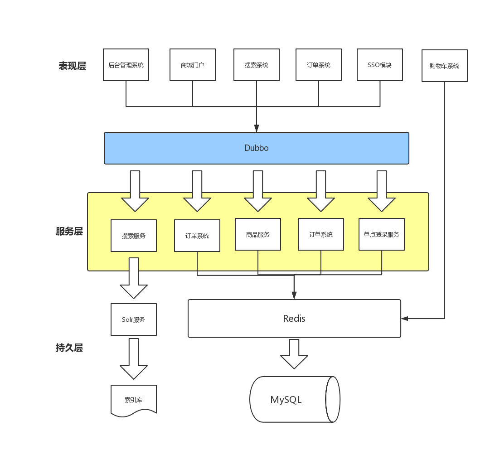
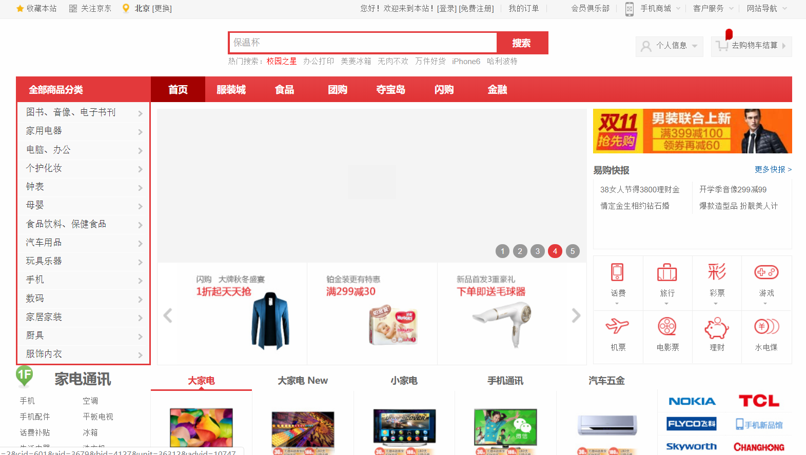
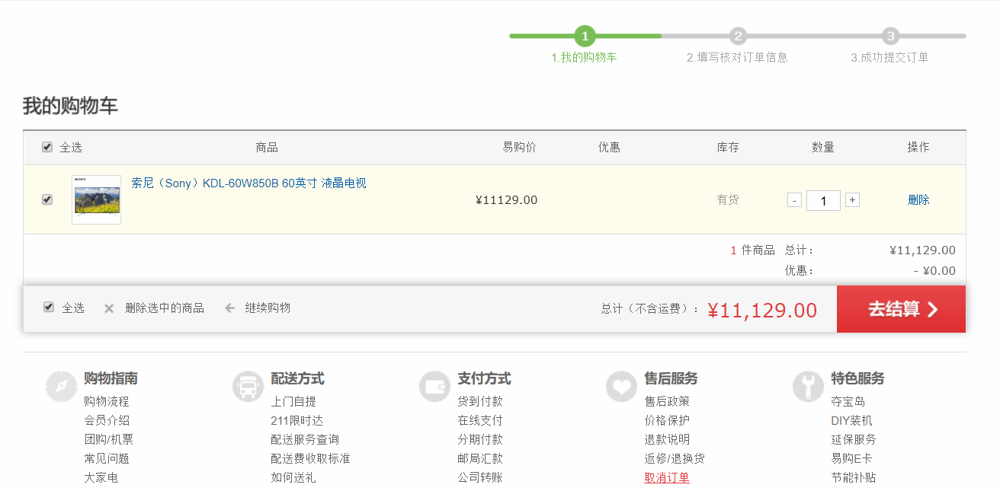
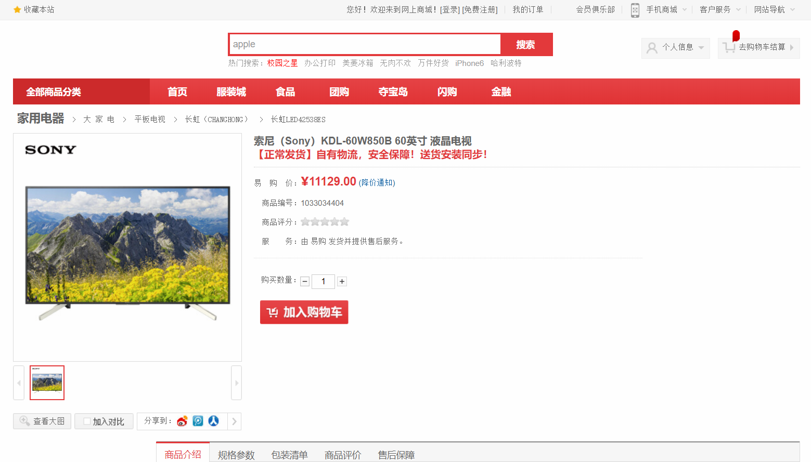
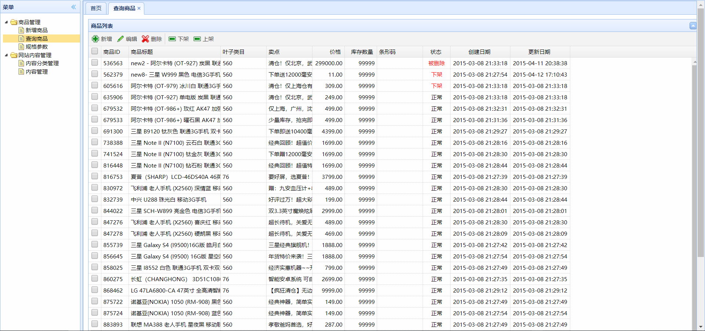
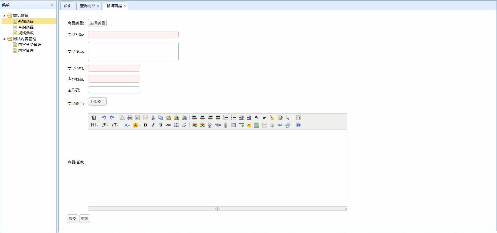
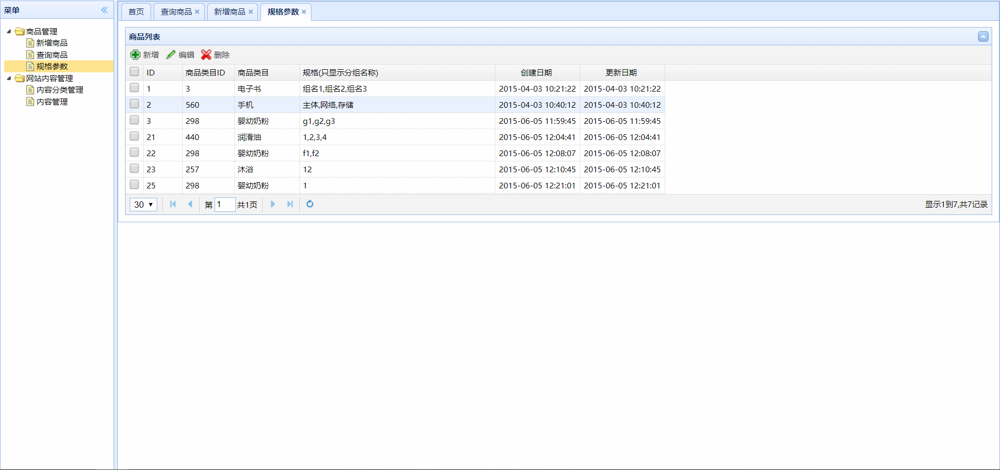
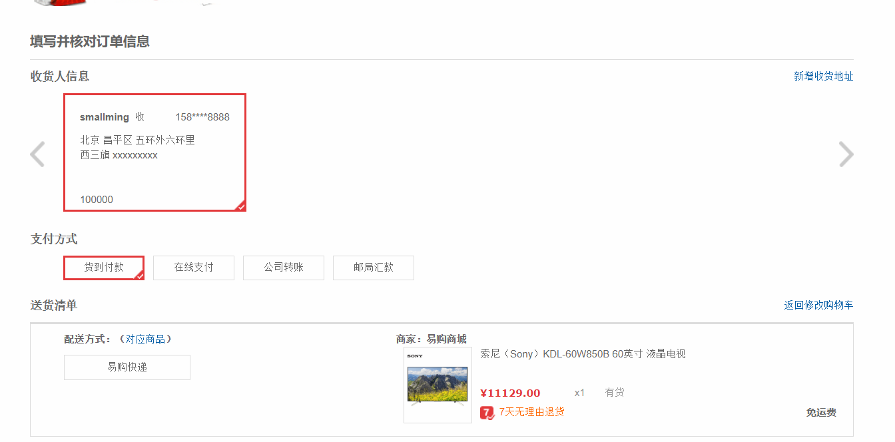
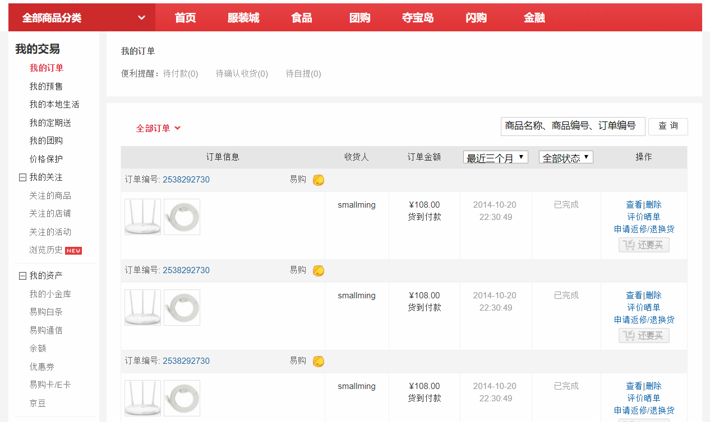

# eshop网上商城
### 技术选型:

后台框架：Spring、SpringMVC、MyBatis

前端技术：JSP、jQuery、EasyUI

数据库：Redis、MySQL

服务器：Tomcat、Nginx

服务调度：Dubbo

跨域技术：Jsonp、HttpClient

### 模块介绍：

commons：存放Cookies、HttpClient等工具类

parent：父项目

pojo：实体类

service：服务接口

service-impl：dubbo的生产者

manage：后台项目

order：订单模块

passport：SSO单点登录模块

redis：缓存模块

search：搜索模块

### 系统框架：

### 项目效果：

##### 门户模块

##### 购物车模块

##### 商品模块

##### 后台模块

##### 订单模块

