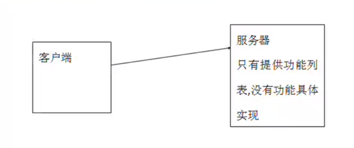
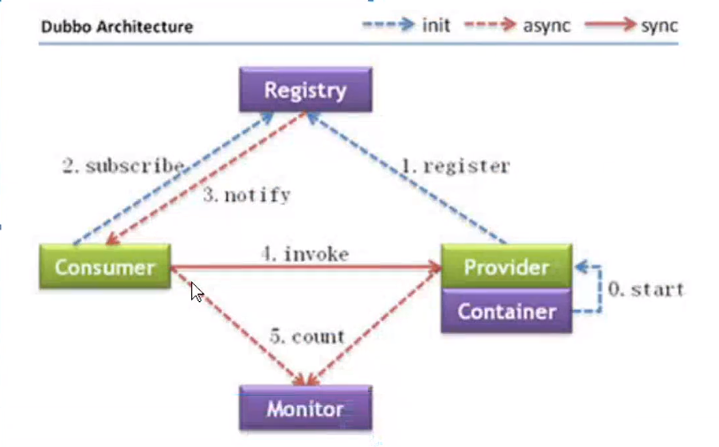

# Dubbo

# 一，SOA

1.英文名称(Service Oriented Architecture)

2.中文名称：面向服务架构

​       2.1有一个专门提供服务的单元

​       2.2其他所有单元都调用这个服务

3. SOA定位：

​       3.1如何**设计项目**，让开发时更有效率

​       3.2 SOA是一种思想

4.之前项目架构设计

​       4.1在公司项目不允许所有项目都访问你数据库

​       4.2开发时，数据库访问层代码可能出现冗余

5. 使用SOA架构

​       5.1拥有专门访问数据库的 服务(项目)

​       5.2开发时可以试想，数据访问控制和代码复用

6.实现SOA架构时，常用服务

​       6.1 Dubbo作为服务

​       6.2 WebService作为服务

​       6.3 Dubbox作为服务

​       6.4 服务方，就是wen项目，调用项目的控制器

​              6.4.1 使用 HttpClient可以调用其他项目的控制器

# 二，RPC

1.英文名称：Remote Procedure Call

2.中文名称：远程过程调用协议

3.RPC解析：客户端(A)通过互联网调用远程服务器，不知道远程服务器具体实现，只知道服务器提供了什么功能

4. RPC最大优点

​       4.1数据安全性

# 三，Dubbo简介

1.Dubbo：一个分布式、高性能、透明化的RPC服务框架

2.作用：提供服务自动注册、自动发现等高效服务治理方案

3.Dubbo架构图

​       3.1 Provider：提供者，服务发布方

​       3.2 Consumer：消费者，调用服务方

​       3.3 Container：Dubbo容器. 依赖于Spring容器

​       3.4 Registry：注册中心。当Container启动时把所有可以提供的服务列表上Registry中进行注册

​              3.4.1作用：告诉Consumer提供了什么服务和服务方在哪里

​       3.5 Moniter：监听器

​       3.6 虚线都是异步访问，实现都是同步访问

​       3.7蓝色虚线：在启动时完成的功能

​       3.8红色虚线(实线)都是程序运行过程中执行的功能

​       3.9所有的角色都是可以在单独的服务器上所以必须遵守特定的协议

4.运行原理：

​       4.0启动容器，相当于启动Dubbo的Provider

​       4.1启动后回去注册中心进行注册，注册所有可以提供的服务列表

​       4.2在Consumer启动后会去Registy中获取服务列表和Provider的地址，进行订阅

​       4.3当Provider有修改后，注册中心会把消息推送给Consumer

​              4.3.1使用了观察者设计模式(又叫发布/订阅设计模式)

​       4.4根据获取到的Provider地址，真是调用Provider中功能

​              4.4.1在Consumer方使用了代理设计模式，创建了一个Provider方类的一个代理对象，通过代理对象获取Provider中真实功能，起到了保护Provider真实功能的作用

4.5 Consumer和Provider每隔1分钟向Monitor发送统计信息，统计信息包含：访问次数，频率等。

# 四，Dubbo中的四种注册中心

1.Zookeeper

​	1.1优点：支持网络集群

​	1.2缺点：稳定性受限于Zookeeper

2.Redis（周边小功能）

​       2.1优点：性能高

​       2.2缺点：对服务器环境要求较高

3.Multicast

​       3.1优点：免中心化，不需要额外安装软件

​       3.2缺点：建议同机房(局域网)内使用

4.Simple

​       4.1适用于测试环境，不支持集群

 

# 五，zookeeper讲解

1.Zookeeper：分布式协调组件

​       1.1本质：一个软件

2.Zookeeper常用功能

​       2.1发布订阅功能。此为把Zookeeper当做注册中心的原因

​       2.2分布式/集群管理功能

3.使用java语言编写

 

# 六，Dubbo支持的协议

1.Dubbo

​       1.1 Dubbo官方推荐的协议

​       1.2本质：使用NIO和线程池进行处理

​       1.3缺点：大文件传输时可能出现文件传输失败问题

2.RMI

​       2.1 JDK提供的协议，远程方法调用协议

​       2.2缺点：偶尔链接失败，需要重启

​       2.3优点：JDK原生，不需要进行额外配置

3.Hession

​       3.1优点：基于http协议，http请求支持

​       3.2缺点：需要额外导入jar，并在短连接时性能低

