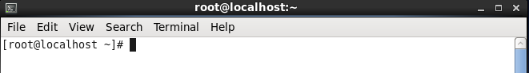

# Linux常用命令及系统目录介绍

1.系统路径

​       1.1  / 表示根目录

​       1.2  ~ 表示/root

​       1.3  etc 存放系统配置界面

​       1.4  home 除了root以外所有用户默认在home下新建一个以用户名作为文件夹名称的文件夹

​              1.4.1 用户xxx 对/home/xxx具有完全操作权限

​       1.5  root 用户root单独文件夹

​       1.6  usr 所有用户安装的软件都放入到这个文件夹中

​              1.6.1 在usr/local 下新建一个tmp，所有压缩包都上传到tmp中

​       

2.常用命令

​       2.1 pwd 打印工作目录，当前所有文件夹全路径

​       2.2 cd 进入到文件夹

​              2.2.1 cd ..    向上跳一级文件夹

​              2.2.2 cd 路径 进入指定文件夹

​       2.3  mkdir 新建空文件夹

​       2.4  ls 平铺     ll 详细列表

​       2.5  vi和vim都是编辑文件

​              2.5.1 如果文件不存在，带有创建文件功能

​              2.5.2  vi普通编辑   vim 高级编辑(带有颜色)

​              2.5.3进入到编辑器后非可编辑状态，点击“i”或“insert”启用编辑状态

​              2.5.4编辑后点击“esc”退出编辑状态，输入

​                     2.5.4.1  :wq 保存并推出

​                     2.5.4.2  :q 不保存退出(适用于没有编辑时)

​                     2.5.4.3  :q! 强制退出

​       2.6  touch创建空文件

​       2.7  cat查看文件全部内容

​       2.8  head[-n] 文件名 查看文件前n行，默认前10行

​       2.9  tail[-n] 文件名 查看文件后n行，默认后10行

​              2.9.1  tailf 动态显示文件后n行内容。常用在显示tomcat日志文件功能

​       2.10  echo‘内容’>>文件名 向文件中添加一些内容

​       2.11  ifconfig 打印网卡信息

​       2.12  reboot 重启

​       2.13  tar zxvf 文件名    解压

​       2.14  cp[-r] 原文件     新文件路径  ： 赋值文件

​              2.14.1  -r 复制文件夹

​       2.15  ctrl+C 中断

​       2.16  mv  原文件    新文件   ： 剪切(具备重命名功能)

​       2.17  rm[-rf] 文件名     ：删除

​              2.17.1  -r  删除目录

​              2.7.2  -f  强制删除，不需要确认

​       2.18  clear  清屏

3.不同用户登录效果

​       3.1普通用户

 

​       3.2 root用户

 

4.Linux所有需要写路径的地方支持两种写法

​       4.1 全路径，标志：以 / 开头