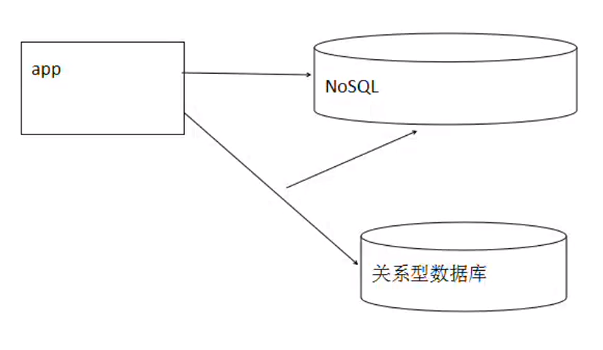
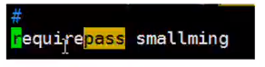

# Redis、Jedis、Junit4

# 一，Redis简介

1.Redis是一个基于key-value形式进行存储的内存型数据库。

​       1.1数据存储方式为key-value（键值对）

​       1.2数据存储在内存中

​              1.2.1优点：效率高。理论值：每秒10K数据读取

​       1.3定位：数据库软件

​              1.3.1作用：存储数据

2.Redis是一个NoSQL数据库

​       2.1字面理解：不使用SQL命令操作数据库软件

​       2.2 NoSQL：英文全称 Not Only SQL，表示在应用程序开发时，不是必须使用关系型数据库，可以使用NoSQL替代关系型数据库的部分功能

​       2.3 目前NoSQL不能完全替代关系型数据库。使用关系型数据库结合NoSQL数据库进行完成项目

​              2.3.1当数据比较复杂时不适用于NoSQL数据库

​              2.3.2关系型数据库依然作为数据库存储的主要软件

​              2.3.3 NoSQL数据库当作缓存工具来使用

​                     2.3.3.1把某些使用频率高的内容不仅仅存储到关系型数据库中，还存储到NoSQL数据库中

​                     2.3.3.2考虑到：NoSQL和关系型数据库数据同步的问题



3.Redis持久化策略

​       3.1 rdb

​              3.1.1默认的持久化策略

​              3.1.2每隔一定时间后把内存中数据持久化到dump.rdb文件中

​              3.1.3缺点：

​                     3.1.3.1数据过于集中

​                     3.1.3.2可能导致最后的数据没有持久化到dump.rdb中

​                            3.1.3.2.1解决办法：使用命令：SAVE或BGSAVE手动持久化

​       3.2 aof

​              3.2.1监听Redis的日志文件，监听如果返现执行了修改，删除，新增命令。立即根据这条命令把数据写入人持久化

​              3.2.2缺点：

​                     3.2.2.1效率降低

 

# 二，Redis常用命令

1.命令手册网址

```
http://doc.redisfans.com/
```

2.Redis数据类型

​       2.1 String

​       2.2 Hash

​       2.3 List

​       2.4 Set

​       2.5 SortedSet 有序集合

 

 

# 三，Redis几个常用概念

\1. Redis默认有16384 solts(槽)，每个槽可以存储多个hash值

\2. Redis默认不需要密码

​       2.1注释去掉，设置自己的密码



3.设置密码后需要通过

​       3.1 -h 主机ip

​       3.2 -p 端口

​       3.2 -a 密码

```
./redis-cli -h 192.168.139.132 -p 6379 -a smallming
```

 

# 四，Jedis

1.Jedis是Redis的客户端工具jar

```xml
<dependency>
			<groupId>redis.clients</groupId>
			<artifactId>jedis</artifactId>
			<version>2.8.1</version>
</dependency>
```

2.使用非集群版实例代码

```java
Jedis jedis = new Jedis("203.195.200.131",6379);
//新增或修改
String result = jedis.set("address","天河");
//查询
String result1 = jedis.get("address");
//删除
Long index = jedis.del("address");
```


# 五，Junit 4

1.单元你测试插件

2.使用Junit主要目的

​       2.1可以不用编写main方法

3.要求：

​       3.1方法必须是 public void且没有参数

​       3.2当前项目不要有Test否则@Test前后都会只是@Before和@After

4.实现步骤:（Maven）

​       4.1在pom.xml中依赖Junit 4

​       4.2在需要测试的方法上添加@Test

​              4.2.1 @Before在@Test之前执行

​              4.2.2 @After@Test之后执行

​              4.2.3如果有多个@Test每个@Test前后都会执行@Before和@After

```java
@Test
public void testInsert() {}
```

 

# 六，Jedis集群

1.集群的概念：

​       1.1多个业务单元协调工作组成的整体称为集群

​              1.1.1每个业务单元都相同

2.当集群中业务单元中超过1/2个down掉时整个集群不可用

​       2.1建议使用奇数个，整体down掉几率小

3.一主一备模式

​       3.1给每一个业务单元创建一个备份业务单元，原来的业务单元叫做(master)后产生的叫做(slave)

4.集群和伪集群

​       4.1集群：每个业务都安装到单独的服务器上

​       4.2伪集群：所有业务单元都安装到同一个服务器上，通过端口区分不同的业务单元

 

 

 

 

 

 

 

 

 

 

 

 

 