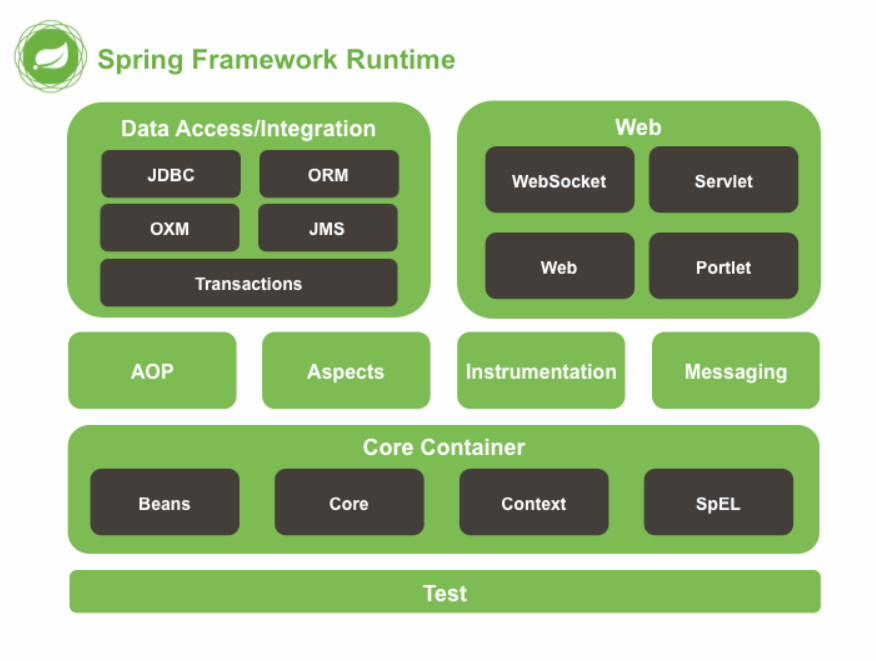
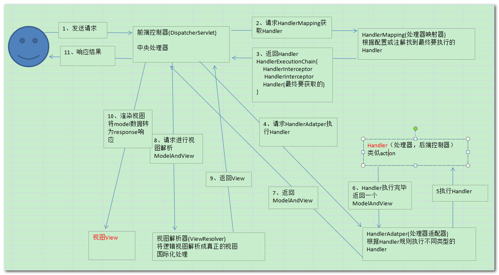

# Spring

1. 轮子理论：不要重复发明轮子,直接使用写好的代码

2. Spring框架宗旨：不重新发明技术，让原有技术使用起来更加方便

3. Spring几大核心功能

   1. IOC/DI      控制反转/依赖注入
   2. AOP        面向切面编程
   3. 声明式事务

4. Spring框架runtime 

   1.  test：spring提供测试功能

   2. Core Container:核心容器。Spring启动最基本的条件

      1. Beans：Spring负责创建类对象并管理对象
      2. Core：核心类
      3.  Context：上下文参数。获取外部资源或者管理注解等
      4.  SpEI：expression.jar   spring表达式语言

   3.  AOP：实现aop功能需要以来

   4.  Aspects：切面AOP依赖的包

   5.  Data Access/Integration：Spring封装数据访问层相关内容

      1. JDBC：Spring对JDBC封装后的代码
      2. ORM：封装了持久层框架的代码。例如：Hibernate
      3. transactions：对应spring-tx.jar，声明式事务使用。

   6.  WEB：需要Spring完成web相关功能是需要

      1. 例如：由tomcat加载spring配置文件时需要有spring-web.jar包

      ​

5. Spring框架中重要的概念

   1. 容器( Container ):Spring当作一个大容器
   2.  BeanFactory接口.老版本。
   3. 新版本中ApplicationContext接口，是BeanFactory子接口。BeanFactory的功能在ApplicationContext中都有。

## IOC控制反转

1.中文名称：控制反转（帮我们创建对象呗）

2.英文名称：（Inversion of Control）

3. IoC是什么？

​      3.1  IoC完成的事情原先由程序员主动通过new实例化事情，转交给Spring负责。

​      3.2 控制反转中 控制 指的是：控制类的对象

​      3.3 控制反转中 反转 指的是:交给Spring负责。

​      3.4  IoC最大的作用：解耦。

​            3.4.1 程序员不需要管理对象。解除了对象管理和程序员之间的耦合。

 

## Spring创建对象的三种方式

1.通过构造方法创建

​      1.1 无参构造创建：默认情况。

​      1.2 有参构造创建：需要明确配置

​            1.2.1 需要在类中提供有参构造方法

​            12.2 在applicationContext.xml中设置调用哪个构造方法创建对象

​                  1.2.2.1 如果设定的条件匹配多个构造方法执行最后的构造

​                  1.2.2.2  index：参数的索引，从0开始

​                  1.2.2.3  name：参数名

​                  1.2.2.4  type:：类型（区分开关键字和封装类int和Integet）

2.实例工厂

​      2.1 工厂设计模式：帮助创建类对象。一个工程可以生产多个对象

​      2.2 实例工程：需要先创建工程，才能生产对象

​      2.3 实现步骤：

​            2.3.1 必须要有一个实例工厂

3.静态工厂  static

​      3.1不需要创建工厂，快速创建对象。

​      3.2 实现步骤

​            3.2.1 编写一个静态工厂（在方法上添加static）

​            3.2.2 applicationContext.xml中（一个bean标签就搞定了）

 

 

## DI

1.DI：中文名字：依赖注入

2.英文名称（Dependency Injection）

3.DI是什么？

​      3.1 DI和IoC是一样的

​      3.2当一个类(A)中需要依赖另一个类对象()时，给另一个对象(B)赋值给(A)的过程就叫做 依赖注入。

 
 ## SpringMVC运行原理

 

 

 

 

 

 

 

 

 

 

 

 
